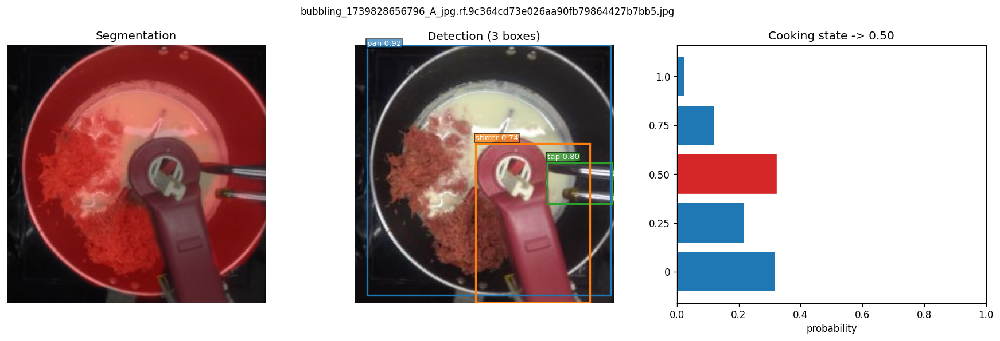

# Multi-task Vision Model: Segmentation + Detection + Cooking-State Classification

A single network with a **shared ResNet-50 backbone**, an **FPN** feature
pyramid, and **three task heads**:

1. **Segmentation head** — pixel-wise binary foreground (Panoptic-FPN style).
2. **Object-detection head** — RetinaNet-style dense head over P3–P7
   (3 classes: `pan`, `stirrer`, `tap`).
3. **State-classification head** — 5-way cooking-doneness classifier
   (`0`, `0.25`, `0.50`, `0.75`, `1.0`).

## Repository layout

```
.
├── model/                 # network components
│   ├── backbone.py        # ResNet-50 -> {C2, C3, C4, C5}
│   ├── fpn.py             # FPN -> {P2..P5, P6, P7}
│   ├── heads.py           # SegmentationHead, ClassificationHead, DetectionHead
│   ├── anchors.py         # AnchorGenerator + IoU matcher + box (de)coder
│   ├── losses.py          # focal, dice, smooth L1
│   └── multitask.py       # MultiTaskModel: task-selective forward
├── mtl_data/              # task-specific datasets + transforms
│   ├── seg_dataset.py
│   ├── det_dataset.py     # COCO -> 3 useful classes (drops dummy "objects")
│   ├── cls_dataset.py
│   └── transforms.py      # letterbox + ImageNet normalize
├── train.py               # round-robin multi-task trainer
├── inference.py           # runs all 3 heads on images, saves PNG visualisations
├── requirements.txt
├── README.md
└── NOTES.md               # short note: architecture, FPN choice, loss balancing
```

## Setup

```bash
python3 -m venv .venv
source .venv/bin/activate
pip install -r requirements.txt
```

Unzip the dataset into `data/`:

```bash
unzip assignment-dataset.zip -d data/
```

You should now have `data/assignment-dataset/{segmentation,detection,classification}/...`.

## Training

The defaults are intentionally small so that a full pipeline run finishes
quickly (CPU-friendly):

```bash
python train.py \
  --data-root data/assignment-dataset \
  --epochs 4 \
  --steps-per-epoch 80 \
  --batch-size 4 \
  --image-size 256
```

Useful flags:

| Flag | What it does |
| --- | --- |
| `--subset-frac 0.6` | Sub-sample each task's data (handy for very fast smoke runs) |
| `--seg-w / --cls-w / --det-w` | Per-task loss weights (default 1.0 each) |
| `--no-pretrained` | Skip the ImageNet weights download (offline / sanity) |
| `--device cuda` | Use GPU (default: auto-detected) |

Checkpoints are saved every epoch to `checkpoints/last.pt`.

A representative validation log from a 4-epoch run on CPU:

```
[val] seg/dice=0.964  cls/acc=0.353  det/has_box_when_gt=1.0   # epoch 0
[val] seg/dice=0.977  cls/acc=0.353  det/has_box_when_gt=1.0   # epoch 1
[val] seg/dice=0.981  cls/acc=0.912  det/has_box_when_gt=1.0   # epoch 2
[val] seg/dice=0.982  cls/acc=0.853  det/has_box_when_gt=1.0   # epoch 3
```

(`seg/dice` is binary foreground IoU; `cls/acc` is top-1; `det/has_box_when_gt`
is a coarse "did we predict at least one box on annotated images" recall proxy.
A proper mAP would require per-class GT/pred matching — see "What I'd improve".)

## Inference + visualizations

Run all three heads and save 3-panel figures (segmentation overlay,
detection boxes, cooking-state probabilities):

```bash
python inference.py \
  --checkpoint checkpoints/last.pt \
  --inputs data/assignment-dataset/detection/images data/assignment-dataset/segmentation/images \
  --output-dir sample_outputs \
  --num-images 5
```

`--inputs` accepts any number of files or directories.

For only one box per class:

```bash
python inference.py \
  --checkpoint checkpoints/last.pt \
  --inputs data/assignment-dataset/segmentation/images \
  --output-dir sample_outputs \
  --top-k-per-class 1
```

Sample output (one image -> one PNG):



## Architecture (1-line summary)

```
                     ┌── C2/C3/C4/C5 ── FPN ──┬── P2..P5 ──> SegmentationHead -> mask
ImageNet ResNet-50 ──┤                        └── P3..P7 ──> DetectionHead    -> boxes + cls
                     └── C5 ─────────────────────────────────> ClassificationHead -> state
```

See [`NOTES.md`](NOTES.md) for the design write-up (½–1 page): why FPN, how the
heads are wired, multi-task loss balancing, and future-work directions.
